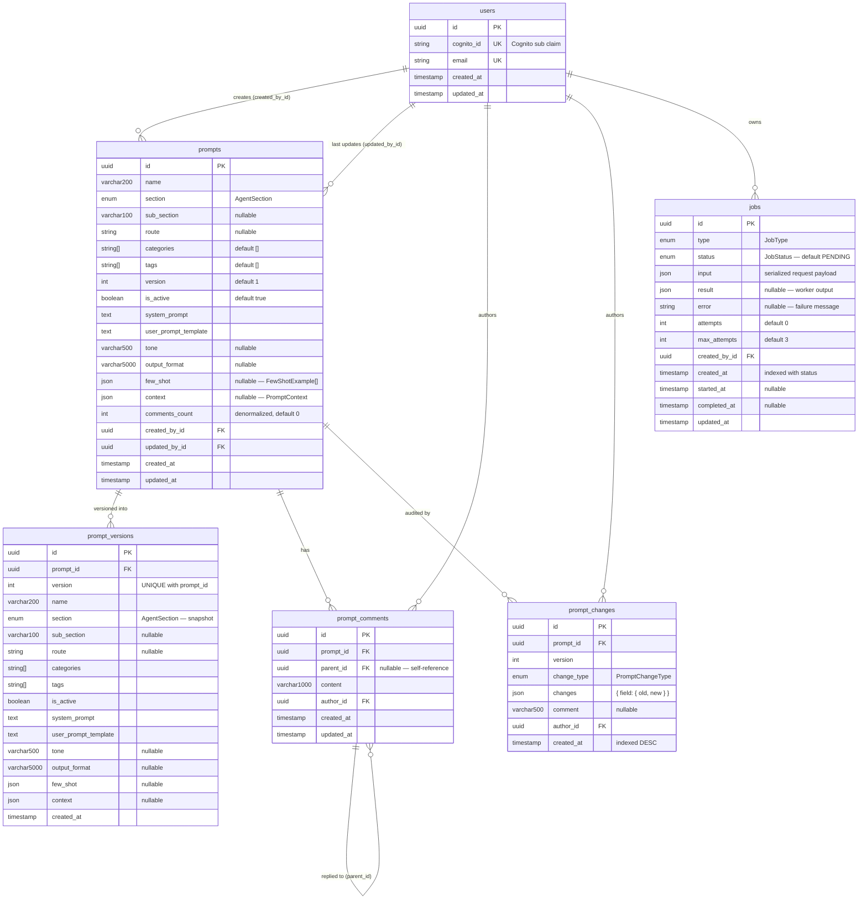

# Database Entity-Relationship Diagram

> **Database:** PostgreSQL 15  
> **ORM:** Prisma 7  
> **Schema source:** `packages/api/prisma/schema.prisma`  
> **Last updated:** 2026-02-24

---

## ERD (Mermaid)

---

## Table Reference

### `users`
Lightweight FK reference table. **Primary user data lives in AWS Cognito.** This table is auto-upserted by `JwtAuthGuard` on every authenticated request so that FK constraints on other tables are always satisfiable.

| Column | Type | Notes |
|--------|------|-------|
| `id` | UUID | Primary key, auto-generated |
| `cognito_id` | VARCHAR | Unique. Maps to the Cognito `sub` claim |
| `email` | VARCHAR | Unique |
| `created_at` | TIMESTAMP | Auto |
| `updated_at` | TIMESTAMP | Auto |

---

### `prompts`
Stores the **latest live version** of each prompt. No JOIN is needed for the common read path. On every update, the current state is first snapshot into `prompt_versions`, then the row is updated in place and `version` is incremented.

| Column | Type | Notes |
|--------|------|-------|
| `id` | UUID | Primary key |
| `name` | VARCHAR(200) | |
| `section` | ENUM `AgentSection` | `parser \| gap_detector \| risk_analysis \| report_generation` |
| `sub_section` | VARCHAR(100) | Nullable |
| `route` | VARCHAR | Nullable |
| `categories` | VARCHAR[] | Default `[]` |
| `tags` | VARCHAR[] | Default `[]` |
| `version` | INT | Starts at 1, increments on every update |
| `is_active` | BOOLEAN | Default `true` |
| `system_prompt` | TEXT | |
| `user_prompt_template` | TEXT | |
| `tone` | VARCHAR(500) | Nullable |
| `output_format` | VARCHAR(5000) | Nullable |
| `few_shot` | JSON | Nullable. Shape: `FewShotExample[]` `{ input, output }` |
| `context` | JSON | Nullable. Shape: `{ persona?, sources?, constraints?, guardrails? }` |
| `comments_count` | INT | Denormalized counter. Kept in sync via `$transaction` in `CommentsService` |
| `created_by_id` | UUID FK → `users.id` | |
| `updated_by_id` | UUID FK → `users.id` | |

**Indexes:**
- `(section, is_active)` — fast lookup for the public runtime endpoint
- `(section, route, sub_section, is_active)` — conflict detection on `toggle-active`

---

### `prompt_versions`
Immutable historical snapshots. One row per `(prompt_id, version)` pair. Created automatically every time a prompt is updated. Contains a full copy of all prompt content fields at that point in time — no JOIN back to `prompts` needed to reconstruct any past state.

| Column | Notes |
|--------|-------|
| `prompt_id` | FK → `prompts.id` (cascade delete) |
| `version` | UNIQUE together with `prompt_id` |
| *(all content fields)* | Full snapshot of `prompts` content columns |

---

### `prompt_comments`
Threaded comments. Top-level comments have `parent_id = NULL`. Replies set `parent_id` to the top-level comment's `id` (one level of nesting in practice, but the schema supports arbitrary depth).

| Column | Notes |
|--------|-------|
| `prompt_id` | FK → `prompts.id` (cascade delete). Indexed. |
| `parent_id` | FK → `prompt_comments.id` (self-reference). Nullable. |
| `content` | VARCHAR(1000) |
| `author_id` | FK → `users.id` |

---

### `prompt_changes`
Append-only audit trail. One row per mutation event. The `changes` JSON column stores a field-level diff computed by `ChangeHistoryService.computeDiff()`.

| Column | Notes |
|--------|-------|
| `prompt_id` | FK → `prompts.id` (cascade delete) |
| `version` | Version number at time of change |
| `change_type` | `CREATE \| UPDATE \| DELETE \| ACTIVATE \| DEACTIVATE` |
| `changes` | `{ fieldName: { old: value, new: value } }` |
| `comment` | Optional annotation (VARCHAR 500) |
| `author_id` | FK → `users.id` |

**Index:** `(prompt_id, created_at DESC)` — history queries ordered newest first.

---

### `jobs`
Tracks every async AI operation from creation through completion. Created by the API Lambda, processed by the Worker Lambda, polled by the frontend.

| Column | Notes |
|--------|-------|
| `type` | `AI_PREVIEW \| PARSE_DOCUMENT \| GAP_DETECTION \| RISK_ANALYSIS \| REPORT_GENERATION` |
| `status` | `PENDING → PROCESSING → COMPLETED \| FAILED` |
| `input` | JSON — serialized request payload passed to the handler |
| `result` | JSON — worker output on success |
| `error` | String — failure message |
| `attempts` | Incremented each time the Worker picks up the job |
| `max_attempts` | Default 3. When `attempts >= max_attempts` on failure → `FAILED` |
| `created_by_id` | FK → `users.id`. Used for ownership check on `GET /api/jobs/:id` |
| `started_at` | Set when Worker sets status to `PROCESSING` |
| `completed_at` | Set when Worker sets status to `COMPLETED` or `FAILED` |

**Index:** `(status, created_at)` — job queue queries by status.

---

## Cascade Delete Rules

| Child table | Trigger | Behaviour |
|-------------|---------|-----------|
| `prompt_versions` | `prompts` row deleted | Cascade delete all version snapshots |
| `prompt_comments` | `prompts` row deleted | Cascade delete all comments |
| `prompt_changes` | `prompts` row deleted | Cascade delete all audit entries |
| `jobs` | (none) | Jobs are never cascade-deleted — they are a permanent audit record |
| `prompt_comments` (self) | Parent comment deleted | No cascade defined — orphaned replies keep their `parent_id` pointing to a deleted row |

---

## Future Models (Planned — Epic 1–4)

The following models are referenced in code comments but not yet defined in the schema. They will be added as each Epic is implemented:

| Model | Epic | Purpose |
|-------|------|---------|
| `Document` | Epic 1 | Uploaded files; links to S3 key; tracks Textract job |
| `Assessment` | Epic 2 | A full risk assessment run; groups all job results |
| `RiskScore` | Epic 3 | Per-category score for an assessment |
| `RiskRule` | Epic 3 | Configurable scoring rules per risk category |
