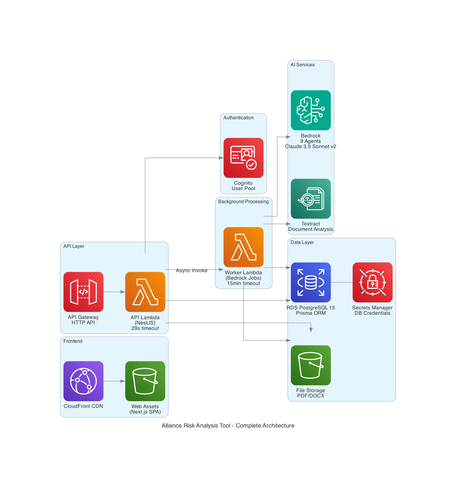
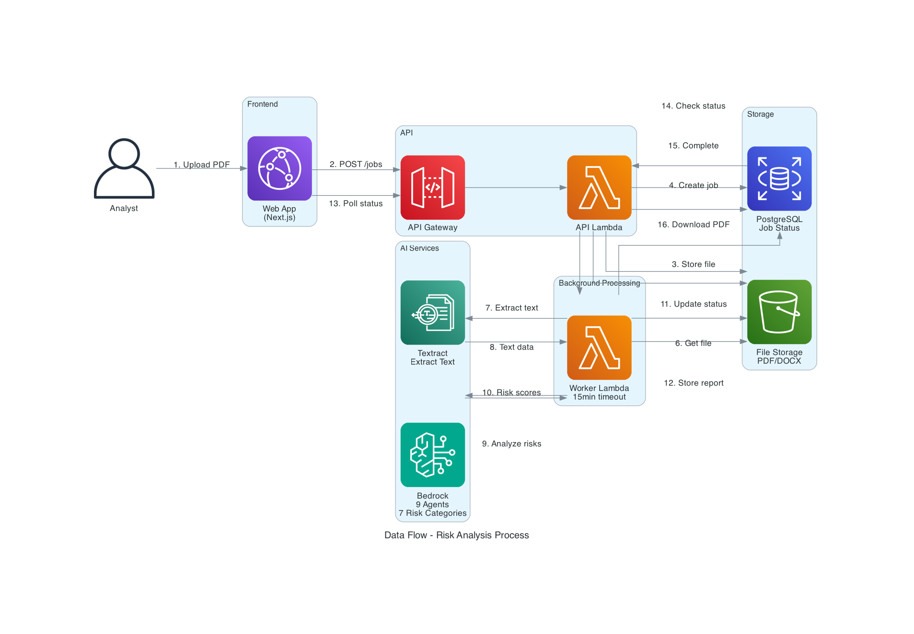
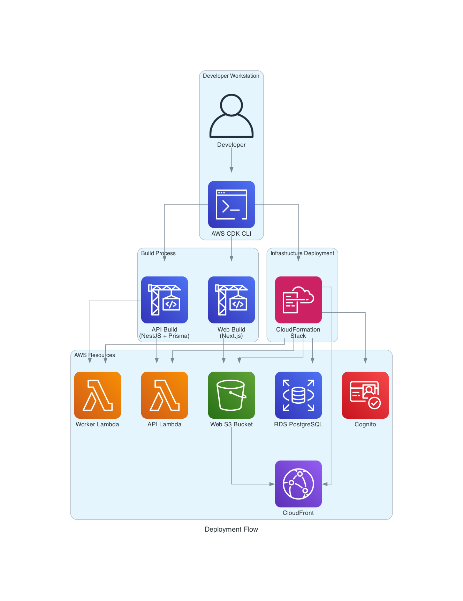

# Infrastructure Documentation

## Overview

The CGIAR Risk Intelligence Tool is deployed on AWS using a serverless architecture. This document provides a complete reference for understanding, deploying, and maintaining the infrastructure.

## Architecture

### Complete Architecture Diagram



### Key Components

| Component | Service | Purpose |
|-----------|---------|---------|
| **Frontend** | CloudFront + S3 | Static Next.js SPA with global CDN |
| **API** | API Gateway + Lambda | NestJS REST API (29s timeout) |
| **Background Processing** | Lambda | Long-running Bedrock jobs (15min timeout) |
| **Authentication** | Cognito | User management with admin group |
| **Database** | RDS PostgreSQL 15 | Primary data store with Prisma ORM |
| **File Storage** | S3 | PDF/DOCX uploads and generated reports |
| **AI Services** | Bedrock + Textract | Document analysis and risk assessment |
| **Secrets** | Secrets Manager | Database credentials |

## Environments

The infrastructure supports three environments:

| Environment | Purpose | CORS Origin |
|-------------|---------|-------------|
| **dev** | Development and testing | `*` (all origins) |
| **staging** | Pre-production validation | `https://staging.alliance-risk.example.com` |
| **production** | Live production system | `https://app.alliance-risk.example.com` |

### Environment Configuration

Environment-specific parameters are defined in `infra/cfn/parameters.json`:

```json
{
  "dev": {
    "Parameters": {
      "Environment": "dev",
      "VpcId": "vpc-xxx",
      "SubnetIds": "subnet-xxx,subnet-yyy,...",
      "ApiCodeS3Bucket": "alliance-risk-deploy-dev",
      "ApiCodeS3Key": "api/latest.zip",
      "CorsOrigin": "*"
    }
  }
}
```

## AWS Services

### 1. Amazon Cognito

**Purpose**: User authentication and authorization

**Configuration**:
- User Pool: `alliance-risk-user-pool`
- Sign-in: Email-based
- Self sign-up: Disabled (admin-managed)
- Password policy: 8+ chars, uppercase, lowercase, digits
- Token validity: 1h access, 30d refresh
- Groups: `admin` (platform administrators)

**Outputs**:
- `CognitoUserPoolId`: User Pool ID for API configuration
- `CognitoClientId`: App Client ID for frontend

### 2. Amazon RDS PostgreSQL

**Purpose**: Primary database for jobs, prompts, users

**Configuration**:
- Engine: PostgreSQL 15
- Instance: `db.t3.micro`
- Storage: 20GB GP3
- Accessibility: Public (MVP - restrict in production)
- Database: `alliance_risk`
- Backup retention: 7 days
- Credentials: Auto-generated in Secrets Manager

**Security**:
- Security group allows PostgreSQL (5432) from anywhere (MVP)
- Credentials stored in `alliance-risk/db-credentials` secret

**Outputs**:
- `DatabaseEndpoint`: Connection endpoint for API

### 3. AWS Lambda Functions

#### API Lambda

**Purpose**: Handle HTTP requests from API Gateway

**Configuration**:
- Function name: `alliance-risk-api`
- Runtime: Node.js 20.x (ARM64)
- Handler: `dist/lambda.handler`
- Timeout: 29 seconds (< API Gateway 30s limit)
- Memory: 1024 MB

**Permissions**:
- Cognito: User management, authentication
- Bedrock: Model invocation
- Textract: Document analysis
- S3: File operations on file bucket
- Lambda: Invoke worker function

**Environment Variables**:
- `ENVIRONMENT`: Deployment environment
- `COGNITO_USER_POOL_ID`: Cognito User Pool ID
- `COGNITO_CLIENT_ID`: Cognito App Client ID
- `S3_BUCKET_NAME`: File storage bucket
- `WORKER_FUNCTION_NAME`: Worker Lambda name
- `CORS_ORIGIN`: Allowed CORS origin

#### Worker Lambda

**Purpose**: Execute long-running Bedrock analysis jobs

**Configuration**:
- Function name: `alliance-risk-worker`
- Runtime: Node.js 20.x (ARM64)
- Handler: `dist/worker.handler`
- Timeout: 15 minutes
- Memory: 1024 MB

**Permissions**:
- Bedrock: Model invocation, retrieval
- Textract: Document analysis
- S3: File operations
- RDS: Database access (via connection string)

**Invocation**: Asynchronous from API Lambda

### 4. Amazon API Gateway

**Purpose**: HTTP API endpoint for frontend

**Configuration**:
- Type: HTTP API (v2)
- Name: `alliance-risk-api`
- Integration: Lambda proxy (payload format v2.0)
- CORS: Enabled for all origins (configurable per environment)

**CORS Settings**:
- Headers: `Content-Type`, `Authorization`
- Methods: `GET`, `POST`, `PUT`, `DELETE`, `PATCH`, `OPTIONS`
- Max age: 1 day

**Outputs**:
- `ApiUrl`: API endpoint URL for frontend configuration

### 5. Amazon S3

#### File Storage Bucket

**Purpose**: Store uploaded business plans and generated reports

**Configuration**:
- Name: `alliance-risk-files-{account-id}`
- Public access: Blocked
- Encryption: S3-managed (SSE-S3)
- Versioning: Disabled
- Retention: Retained on stack deletion

**Access**: Lambda functions via IAM role

#### Web Hosting Bucket

**Purpose**: Host static Next.js frontend

**Configuration**:
- Name: `alliance-risk-web-{account-id}`
- Public access: Blocked (CloudFront OAI only)
- Encryption: S3-managed (SSE-S3)
- Auto-delete: Enabled on stack deletion

**Access**: CloudFront via Origin Access Identity

### 6. Amazon CloudFront

**Purpose**: Global CDN for frontend with SPA routing

**Configuration**:
- Origin: Web S3 bucket via OAI
- Protocol: HTTPS redirect
- Price class: 100 (North America, Europe)
- HTTP version: HTTP/2
- Default object: `index.html`

**Error Handling** (SPA fallback):
- 403 → 200 `/index.html` (TTL: 0s)
- 404 → 200 `/index.html` (TTL: 0s)

**Outputs**:
- `CloudFrontUrl`: Distribution URL for accessing frontend

### 7. AWS Bedrock

**Purpose**: AI-powered risk analysis

**Configuration**:
- Model: Claude 3.5 Sonnet v2
- Agents: 9 specialized agents
- Knowledge Bases: 7 (one per risk category)

**Permissions**: Lambda functions can invoke models and retrieve from KBs

### 8. Amazon Textract

**Purpose**: Extract text from PDF/DOCX business plans

**Permissions**: Lambda functions can start and get document analysis

### 9. AWS Secrets Manager

**Purpose**: Store RDS credentials securely

**Configuration**:
- Secret name: `alliance-risk/db-credentials`
- Auto-generated: Username `postgres` + random password
- Rotation: Not configured (manual in production)

## Data Flow

### Risk Analysis Process



1. **Upload**: Analyst uploads business plan PDF via web app
2. **API Request**: Frontend sends POST to `/jobs` via API Gateway
3. **Store File**: API Lambda uploads file to S3
4. **Create Job**: API Lambda creates job record in PostgreSQL
5. **Async Invoke**: API Lambda invokes Worker Lambda asynchronously
6. **Retrieve File**: Worker Lambda downloads file from S3
7. **Extract Text**: Worker Lambda calls Textract for text extraction
8. **Text Data**: Textract returns extracted text
9. **Analyze Risks**: Worker Lambda invokes Bedrock agents for 7 risk categories
10. **Risk Scores**: Bedrock returns risk assessments
11. **Update Status**: Worker Lambda updates job status in database
12. **Store Report**: Worker Lambda generates and uploads PDF report to S3
13. **Poll Status**: Frontend polls API for job completion
14. **Check Status**: API Lambda queries database for job status
15. **Complete**: Database returns completed status
16. **Download PDF**: Frontend downloads report from S3 via API

## Deployment

### Prerequisites

- **Node.js** >= 20
- **pnpm** >= 9
- **AWS CLI** configured with credentials
- **AWS CDK** (installed via `pnpm` in infra package)

### Deployment Methods

#### Method 1: AWS CDK (Recommended)

CDK provides type-safe infrastructure definitions and automatic dependency management.

**Commands**:

```bash
cd infra

# Install dependencies
pnpm install

# Synthesize CloudFormation template (preview)
pnpm synth

# Preview changes before deployment
pnpm diff

# Deploy to AWS
pnpm deploy

# Deploy with auto-approval (CI/CD)
pnpm deploy -- --require-approval never
```

**First-time setup**:

```bash
# Bootstrap CDK in your AWS account (one-time)
npx cdk bootstrap aws://ACCOUNT-ID/REGION
```

#### Method 2: CloudFormation (No CDK Required)

Direct CloudFormation deployment using pre-synthesized templates.

**Commands**:

```bash
cd infra

# Validate template
pnpm cfn:validate

# Deploy to dev environment
pnpm cfn:deploy dev

# Deploy to staging
pnpm cfn:deploy staging

# Deploy to production
pnpm cfn:deploy production
```

**Manual deployment**:

```bash
cd infra/cfn

# Validate
aws cloudformation validate-template \
  --template-body file://alliance-risk-stack.template.yaml

# Deploy
aws cloudformation deploy \
  --template-file alliance-risk-stack.template.yaml \
  --stack-name AllianceRiskStack \
  --capabilities CAPABILITY_IAM CAPABILITY_NAMED_IAM \
  --parameter-overrides \
    Environment=dev \
    VpcId=vpc-xxx \
    SubnetIds=subnet-xxx,subnet-yyy \
    ApiCodeS3Bucket=alliance-risk-deploy-dev \
    ApiCodeS3Key=api/latest.zip \
    CorsOrigin=*
```

### Deployment Flow



1. Developer runs CDK/CloudFormation command
2. API code is built (NestJS + Prisma)
3. Web code is built (Next.js static export)
4. CloudFormation stack is created/updated
5. Resources are provisioned:
   - Lambda functions (API + Worker)
   - S3 buckets (files + web)
   - CloudFront distribution
   - RDS PostgreSQL instance
   - Cognito User Pool
   - API Gateway
6. Stack outputs are displayed

### Post-Deployment Steps

1. **Retrieve Stack Outputs**:

```bash
aws cloudformation describe-stacks \
  --stack-name AllianceRiskStack \
  --query "Stacks[0].Outputs"
```

2. **Configure Frontend**:

Update `packages/web/.env.local` with outputs:

```env
NEXT_PUBLIC_API_URL=<ApiUrl>
NEXT_PUBLIC_COGNITO_USER_POOL_ID=<CognitoUserPoolId>
NEXT_PUBLIC_COGNITO_CLIENT_ID=<CognitoClientId>
```

3. **Run Database Migrations**:

```bash
cd packages/api

# Set DATABASE_URL from RDS endpoint
export DATABASE_URL="postgresql://postgres:PASSWORD@<DatabaseEndpoint>:5432/alliance_risk"

# Run migrations
npx prisma migrate deploy

# Seed initial data
npx prisma db seed
```

4. **Create Admin User**:

```bash
aws cognito-idp admin-create-user \
  --user-pool-id <CognitoUserPoolId> \
  --username admin@example.com \
  --user-attributes Name=email,Value=admin@example.com \
  --temporary-password TempPass123!

aws cognito-idp admin-add-user-to-group \
  --user-pool-id <CognitoUserPoolId> \
  --username admin@example.com \
  --group-name admin
```

5. **Deploy Frontend**:

```bash
cd packages/web

# Build static export
pnpm build

# Upload to S3
aws s3 sync out/ s3://<WebBucketName>/ --delete

# Invalidate CloudFront cache
aws cloudfront create-invalidation \
  --distribution-id <DistributionId> \
  --paths "/*"
```

## CI/CD Integration

### Recommended Pipeline

```yaml
# Example GitHub Actions workflow
name: Deploy

on:
  push:
    branches: [main]

jobs:
  deploy:
    runs-on: ubuntu-latest
    steps:
      - uses: actions/checkout@v3
      
      - name: Setup Node.js
        uses: actions/setup-node@v3
        with:
          node-version: 20
      
      - name: Install pnpm
        run: npm install -g pnpm
      
      - name: Install dependencies
        run: pnpm install
      
      - name: Build API
        run: pnpm --filter @alliance-risk/api build
      
      - name: Build Web
        run: pnpm --filter @alliance-risk/web build
      
      - name: Configure AWS credentials
        uses: aws-actions/configure-aws-credentials@v2
        with:
          aws-access-key-id: ${{ secrets.AWS_ACCESS_KEY_ID }}
          aws-secret-access-key: ${{ secrets.AWS_SECRET_ACCESS_KEY }}
          aws-region: us-east-1
      
      - name: Deploy infrastructure
        run: |
          cd infra
          pnpm deploy -- --require-approval never
      
      - name: Run migrations
        run: |
          cd packages/api
          npx prisma migrate deploy
        env:
          DATABASE_URL: ${{ secrets.DATABASE_URL }}
      
      - name: Deploy frontend
        run: |
          cd packages/web
          aws s3 sync out/ s3://${{ secrets.WEB_BUCKET_NAME }}/ --delete
          aws cloudfront create-invalidation \
            --distribution-id ${{ secrets.CLOUDFRONT_DISTRIBUTION_ID }} \
            --paths "/*"
```

### Deployment Stages

1. **Build**: Compile TypeScript, bundle assets
2. **Test**: Run unit and integration tests
3. **Infrastructure**: Deploy/update CloudFormation stack
4. **Database**: Run Prisma migrations
5. **Frontend**: Upload static assets to S3, invalidate CloudFront
6. **Verify**: Health checks, smoke tests

### Environment Promotion

```
dev → staging → production
```

- **dev**: Automatic deployment on every commit
- **staging**: Manual approval after dev validation
- **production**: Manual approval after staging validation

## Monitoring & Operations

### CloudWatch Logs

**Log Groups**:
- `/aws/lambda/alliance-risk-api`: API Lambda logs
- `/aws/lambda/alliance-risk-worker`: Worker Lambda logs

**Viewing Logs**:

```bash
# API Lambda logs (last 10 minutes)
aws logs tail /aws/lambda/alliance-risk-api --follow

# Worker Lambda logs with filter
aws logs tail /aws/lambda/alliance-risk-worker \
  --filter-pattern "ERROR" \
  --follow
```

### CloudWatch Metrics

**Key Metrics**:
- Lambda invocations, errors, duration, throttles
- API Gateway requests, 4xx/5xx errors, latency
- RDS CPU, connections, storage
- S3 bucket size, requests

**Creating Alarms**:

```bash
# Lambda error alarm
aws cloudwatch put-metric-alarm \
  --alarm-name alliance-risk-api-errors \
  --alarm-description "API Lambda errors > 5 in 5 minutes" \
  --metric-name Errors \
  --namespace AWS/Lambda \
  --statistic Sum \
  --period 300 \
  --threshold 5 \
  --comparison-operator GreaterThanThreshold \
  --dimensions Name=FunctionName,Value=alliance-risk-api \
  --evaluation-periods 1
```

### Cost Monitoring

**Estimated Monthly Costs** (MVP usage):

| Service | Estimated Cost |
|---------|----------------|
| RDS (db.t3.micro) | ~$15 |
| Lambda (1M requests) | ~$5 |
| S3 (100GB storage) | ~$2.30 |
| CloudFront (100GB transfer) | ~$8.50 |
| API Gateway (1M requests) | ~$1 |
| Bedrock (usage-based) | Variable |
| **Total** | **~$32 + Bedrock** |

**Cost Optimization**:
- Use Reserved Instances for RDS in production
- Enable S3 Intelligent-Tiering for file storage
- Set CloudWatch log retention policies
- Monitor Bedrock token usage

## Security

### IAM Roles & Policies

**API Lambda Role**:
- Cognito: User management
- Bedrock: Model invocation
- Textract: Document analysis
- S3: File operations
- Lambda: Invoke worker
- CloudWatch: Logs

**Worker Lambda Role**:
- Bedrock: Model invocation, retrieval
- Textract: Document analysis
- S3: File operations
- CloudWatch: Logs

### Network Security

**RDS Security Group**:
- Inbound: PostgreSQL (5432) from anywhere (MVP)
- **Production**: Restrict to Lambda security group

**VPC Configuration**:
- Uses default VPC (MVP)
- **Production**: Create dedicated VPC with private subnets

### Data Security

- **Encryption at rest**: S3 (SSE-S3), RDS (default)
- **Encryption in transit**: HTTPS/TLS for all API calls
- **Secrets**: Database credentials in Secrets Manager
- **Access control**: IAM roles with least privilege

### Compliance

- **GDPR**: User data stored in PostgreSQL, deletable
- **Data residency**: All data in specified AWS region
- **Audit trail**: CloudWatch logs for all operations

## Troubleshooting

### Common Issues

#### 1. Lambda Timeout

**Symptom**: API requests fail after 29 seconds

**Solution**:
- Check CloudWatch logs for slow operations
- Optimize database queries
- Move long operations to Worker Lambda

#### 2. RDS Connection Errors

**Symptom**: `ECONNREFUSED` or `ETIMEDOUT`

**Solution**:
- Verify security group allows Lambda access
- Check DATABASE_URL environment variable
- Ensure RDS instance is running

#### 3. Cognito Authentication Fails

**Symptom**: 401 Unauthorized errors

**Solution**:
- Verify Cognito User Pool ID and Client ID
- Check user exists and is enabled
- Validate JWT token expiration

#### 4. S3 Access Denied

**Symptom**: `AccessDenied` when uploading/downloading files

**Solution**:
- Verify Lambda IAM role has S3 permissions
- Check bucket policy and CORS configuration
- Ensure bucket name is correct

#### 5. CloudFront 403 Errors

**Symptom**: Frontend returns 403 on page refresh

**Solution**:
- Verify error response configuration (403 → 200 /index.html)
- Check OAI has read access to S3 bucket
- Invalidate CloudFront cache

### Debug Commands

```bash
# Check stack status
aws cloudformation describe-stacks --stack-name AllianceRiskStack

# View stack events
aws cloudformation describe-stack-events \
  --stack-name AllianceRiskStack \
  --max-items 20

# Test Lambda function
aws lambda invoke \
  --function-name alliance-risk-api \
  --payload '{"httpMethod":"GET","path":"/health"}' \
  response.json

# Check RDS connectivity
psql -h <DatabaseEndpoint> -U postgres -d alliance_risk

# List S3 bucket contents
aws s3 ls s3://alliance-risk-files-{account-id}/

# Get CloudFront distribution config
aws cloudfront get-distribution --id <DistributionId>
```

## Disaster Recovery

### Backup Strategy

**RDS**:
- Automated daily backups (7-day retention)
- Manual snapshots before major changes

**S3**:
- Versioning disabled (enable for production)
- Cross-region replication (optional)

### Recovery Procedures

**Database Restore**:

```bash
# List available snapshots
aws rds describe-db-snapshots \
  --db-instance-identifier alliance-risk-db

# Restore from snapshot
aws rds restore-db-instance-from-db-snapshot \
  --db-instance-identifier alliance-risk-db-restored \
  --db-snapshot-identifier <snapshot-id>
```

**Stack Recreation**:

```bash
# Delete stack (preserves RDS and file bucket)
aws cloudformation delete-stack --stack-name AllianceRiskStack

# Redeploy
cd infra
pnpm deploy
```

## Maintenance

### Regular Tasks

**Weekly**:
- Review CloudWatch logs for errors
- Check Lambda execution metrics
- Monitor RDS performance

**Monthly**:
- Review AWS costs
- Update dependencies (security patches)
- Rotate database credentials

**Quarterly**:
- Review IAM permissions
- Update CDK and AWS SDK versions
- Performance testing and optimization

### Scaling Considerations

**Current Limits** (MVP):
- API Lambda: 1000 concurrent executions
- Worker Lambda: 1000 concurrent executions
- RDS: db.t3.micro (1 vCPU, 1GB RAM)
- S3: Unlimited storage

**Scaling Up**:
- Increase Lambda memory/timeout
- Upgrade RDS instance class
- Enable RDS read replicas
- Add CloudFront caching rules
- Implement API rate limiting

## References

- [AWS CDK Documentation](https://docs.aws.amazon.com/cdk/)
- [AWS Lambda Best Practices](https://docs.aws.amazon.com/lambda/latest/dg/best-practices.html)
- [Amazon RDS PostgreSQL](https://docs.aws.amazon.com/AmazonRDS/latest/UserGuide/CHAP_PostgreSQL.html)
- [Amazon Bedrock](https://docs.aws.amazon.com/bedrock/)
- [Prisma Documentation](https://www.prisma.io/docs)
- [Next.js Deployment](https://nextjs.org/docs/deployment)

## Support

For infrastructure issues or questions:
- Review CloudWatch logs
- Check AWS Service Health Dashboard
- Consult this documentation
- Contact DevOps team
