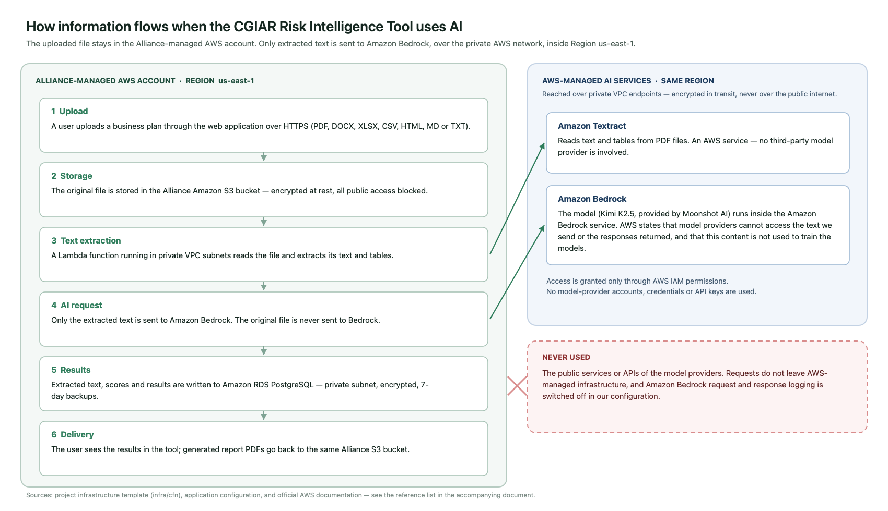

# CGIAR Risk Intelligence Tool — AI Processing with Amazon Bedrock

## What happens to the information submitted to the Risk Intelligence Tool when we use AI, where it is processed, and who can see it

**Audience:** Risk Intelligence Tool stakeholders, CGIAR Centers and Programs, management, Legal and Data Protection, and functional users

## Executive summary

We use Amazon Bedrock, a service from Amazon Web Services (AWS), to access the AI models used by the CGIAR Risk Intelligence Tool. When we use AI, the information needed for the task is processed through AWS-managed services. We do not send this information directly to the model providers' public services or APIs.

The documents that users upload stay in the Alliance-managed AWS account. We read each document inside our own environment and send to Amazon Bedrock only the text that the AI task needs. The original file is never sent to Amazon Bedrock.

During AI processing, the information remains within AWS-managed infrastructure. AWS states that, under the standard Amazon Bedrock configuration, model providers do not have access to the information sent to the model or the responses it generates. AWS also states that this information is not used to train the AI models.

Our AI processing runs in a single AWS Region in the United States (`us-east-1`), and Amazon Bedrock makes the model we use available for in-Region processing only. Our applications reach Amazon Bedrock and Amazon Textract through private network endpoints inside our own AWS network, so these requests do not travel over the public internet. AWS documents some exceptions for specific models or configurations, so we review these conditions before using a new model or changing our AI configuration.

## 1. Why we prepared this document

The Risk Intelligence Tool allows users to upload business plans and supporting evidence in formats such as PDF, Word, Excel, CSV, HTML and plain text. We use AI to read this material, check whether the information we need is present, score the business against seven risk categories, and generate an assessment report.

These files may contain unpublished business information, financial figures, partner information, personal data, or other sensitive information belonging to small and medium agricultural enterprises.

For this reason, there are three questions we need to answer clearly: what happens to this information, where is it processed, and can the model providers see it or use it?

We have reviewed our current AI implementation and AWS configuration to answer these questions. In this document, we explain the results of that review in simple language.

## 2. How we use Amazon Bedrock

### 2.1 Where the information goes

The Risk Intelligence Tool runs in an AWS environment managed by the Alliance infrastructure team. For our AI features, we use Amazon Bedrock, a service managed by AWS. The information needed for these tasks is processed within AWS-managed infrastructure and is not sent directly to the model provider's public service or API. [S2]

AWS is responsible for protecting the infrastructure that supports its services. We remain responsible for how we manage our data, access, permissions, and retention periods. [S2, S10]

### 2.2 Step by step

| Step | What happens, and where |
|------|-------------------------|
| **1. Upload** | The user uploads a document through the web application over an encrypted (HTTPS) connection. |
| **2. Storage** | We store the file in the Alliance-managed AWS environment, in a private storage area (Amazon S3) that is encrypted and closed to public access. |
| **3. Text extraction** | Inside our own environment, we read the document and extract its text and tables. For PDF files we use Amazon Textract, an AWS service. For Word, Excel, CSV, HTML and text files we use standard software libraries running in our own application — no AI and no external service is involved. |
| **4. AI request** | We send to Amazon Bedrock only the extracted text needed for the AI task. The original uploaded file is not sent to Amazon Bedrock. |
| **5. AI processing** | Amazon Bedrock processes the text using the selected AI model on AWS-managed infrastructure and returns a response to us. |
| **6. Result** | We store the result in our own database and show it to the user in the tool, for example as detected gaps, risk scores, or an assessment report. Generated report PDFs are stored back in the same Alliance storage area. |

The important distinction is that the uploaded file remains in our environment, and we send to Amazon Bedrock only the content needed for the AI task.

### 2.3 How we connect

We connect to Amazon Bedrock using AWS access and authentication controls (AWS IAM). We do not use accounts, credentials, or API keys provided by the model providers. Permissions are managed by the Alliance within AWS and are restricted to a defined list of AI models that the tool is allowed to use. [S2]

In addition, the application components that call Amazon Bedrock and Amazon Textract run inside a private network (an AWS VPC) and reach these services through **private network endpoints** created for that purpose. This means those requests stay inside the AWS network and do not travel over the public internet.

### 2.4 Which AI services and models we use

| Service | What we use it for | Who provides the model |
|---------|--------------------|------------------------|
| **Amazon Textract** | Reading text and tables from PDF documents | AWS. No third-party model provider is involved. |
| **Amazon Bedrock** | Checking the completeness of the information, scoring the seven risk categories, generating the assessment report, and previewing prompt changes | The model currently configured is **Kimi K2.5**, provided by Moonshot AI and made available through Amazon Bedrock. |

The model runs inside the Amazon Bedrock service. We do not hold an account with the model provider and we do not send requests to the provider's own service. AWS states that, under the standard Amazon Bedrock configuration, model providers do not have access to the information sent to the model or the responses it generates, and that this information is not used to train the models. [S1, S2, S8]

Our AWS permissions also allow Anthropic Claude models to be used through Amazon Bedrock, including a United States cross-Region option. These models are **not** currently configured in the tool. If we enable them in the future, the conditions described in section 4.1 must be reviewed again, because that option allows AWS to process a request in more than one AWS Region within the United States.

## 3. Who can see and use the information

AWS states that, under the standard Amazon Bedrock configuration, model providers do not have access to the information sent to the model or the responses it generates. AWS also states that this information is not used to train the AI models. [S1, S2, S8]

For the model we use, Amazon Bedrock provides no mechanism that would share this information with the model provider. There is no separate agreement with the provider and no data-sharing setting for the model: it is made available to us under the standard AWS terms, which we have reviewed with Legal and Data Protection. We review these conditions again before using a new model or changing our configuration. [S3, S4, S12]

Within the Alliance environment, access to the tool is controlled through AWS Cognito. Accounts are created only by an administrator, users must set their own password on first login, and password rules require at least 12 characters with upper case, lower case, numbers and symbols. Each user can only see their own assessments; administrator functions are restricted to users in the administrator group.

## 4. Where it is processed, and what is kept

### 4.1 Where it is processed

Our AI processing runs in a single AWS Region in the United States (`us-east-1`). The AI requests are sent directly to the model in that Region.

Amazon Bedrock makes the model we use available for in-Region processing only. AWS publishes no option to route a request for this model to another AWS Region, so our AI requests cannot be processed outside `us-east-1` while this model is the one configured. [S6]

AWS documents that, where cross-Region routing is used, the information remains within AWS infrastructure, does not travel over the public internet between Regions, and is encrypted while it is transferred. [S5, S6] This applies if we enable one of the cross-Region options described in section 2.4, which is why that change requires a new review.

Amazon Textract, which we use to read PDF files, operates under the AWS terms for AI services. Under those terms, AWS may use and store content processed by these services to improve them, and may store it in an AWS Region other than the one where the service was used, unless the customer opts out. We have opted out. An organization-level opt-out policy applies to our account, so AWS does not retain the content we send to Amazon Textract for service improvement. [S11, S13]

The application data — uploaded files, extracted text, results and generated reports — is also stored in the same Region.

### 4.2 What is kept

AWS states that, under the standard Amazon Bedrock behaviour, the information sent to the model and the responses generated are not stored. In our current configuration, the optional Amazon Bedrock feature that can log this content is also switched off. [S3, S4, S7]

The same applies to Amazon Textract: because of the opt-out described in section 4.1, AWS does not keep the content of the PDF files we send to it. [S11, S13]

Separately, we keep the information the Risk Intelligence Tool needs to operate. This information remains in our AWS environment and is managed by the Alliance:

| What we keep | Where | Protection |
|--------------|-------|------------|
| Uploaded documents and generated report PDFs | Amazon S3, Alliance account | Encrypted at rest, all public access blocked, access only through the application |
| Extracted document text, detected gaps, risk scores and report content | Amazon RDS PostgreSQL database | Encrypted at rest, private network only, no public access, 7 days of automated backups |
| Login accounts and permissions | AWS Cognito | Managed by AWS; passwords are never stored by the application |
| Application and error logs | Amazon CloudWatch Logs | Record file names, sizes, durations and error messages — not the content of the documents, the AI requests, or the AI responses |
| Database credentials and internal service tokens | AWS Secrets Manager | Generated and stored by AWS; never written in the source code |

When a user deletes a document from an assessment, the application deletes the stored file and the corresponding extraction record.

## 5. Our commitments

The sections above explain how Amazon Bedrock works and what AWS states about the service. In addition, we have defined our own controls to protect information when we use AI:

- We do not allow confidential or restricted information to be shared with model providers without prior review and approval from Security, Legal, and Data Protection.
- We send to Amazon Bedrock only the information needed for the AI task, never the original uploaded file.
- We control access to AI models through AWS permissions, restricted to an explicit list of approved models, and we use AWS security and encryption controls to protect the information.
- We keep the traffic between our application and the AI services inside the AWS network, using private network endpoints.
- We have opted out of the use of our content for the improvement of AWS AI services, so that the documents we process are used only to deliver the result we asked for.
- We apply retention and deletion controls to the information we store. We do not keep complete documents, AI requests, or AI responses in application logs unless there is a documented need.
- We review AWS conditions before using a new model or model version, including where the information may be processed, and we update the information provided to users when needed.

### Improvements already identified

These items do not change the answers above, but we have identified them during this review and plan to address them:

| Item | Planned improvement |
|------|---------------------|
| Application log retention is not yet limited to a fixed period | Set an explicit retention period for the application log groups |
| Files are deleted when a user deletes a document or assessment, but there is no automatic retention schedule | Define and apply a retention period for uploaded documents and generated reports |
| Storage encryption uses AWS-managed keys | Evaluate moving to an Alliance-managed encryption key (AWS KMS) for the file storage and database |
| The development environment accepts requests from any web origin | Restrict this to the official application address in staging and production |

## 6. What we tell our users

The following notice is recommended for the Risk Intelligence Tool platform pages, with a link to this document for users who want more information.

> **AI-assisted document processing.** We use Amazon Bedrock, a service from Amazon Web Services (AWS), for our AI features. Your uploaded file stays in the Alliance-managed AWS environment; we send to Amazon Bedrock only the text needed for the AI task. During this process, the information remains within AWS-managed infrastructure.
>
> AWS states that, under the standard Amazon Bedrock configuration, model providers do not have access to the information sent to the model or the responses it generates, and that this information is not used to train the AI models. Our AI processing runs in an AWS Region in the United States.
>
> The information we need to keep for the Risk Intelligence Tool to operate remains within AWS and is managed by us.

## 7. Limitations and AWS references

This document is written for a non-technical audience and is based on our review of the Risk Intelligence Tool AI implementation and AWS configuration, together with official AWS documentation.

The information in this document reflects our current AI configuration and the AWS conditions reviewed for the models and services we use.

This document is not legal advice, a formal data protection impact assessment, or an independent security audit.

The following official AWS sources support the information presented in this document:

- **[S1] Amazon Bedrock security, privacy, and responsible AI.** AWS states that inputs and outputs are not shared with model providers and are not used to train the base models.
  https://aws.amazon.com/bedrock/security-privacy-responsible-ai/
- **[S2] Data protection — Amazon Bedrock.** AWS describes how model software is deployed inside the Bedrock service, the provider access boundary, and the shared-responsibility model.
  https://docs.aws.amazon.com/bedrock/latest/userguide/data-protection.html
- **[S3] Amazon Bedrock abuse detection.** AWS describes the default behaviour of not storing or exposing inputs and outputs, and its documented exceptions.
  https://docs.aws.amazon.com/bedrock/latest/userguide/abuse-detection.html
- **[S4] Data retention — Amazon Bedrock.** AWS documents the retention options, including the opt-in setting that allows sharing with a model provider.
  https://docs.aws.amazon.com/bedrock/latest/userguide/data-retention.html
- **[S5] Route model inference requests across AWS Regions with cross-Region inference — Amazon Bedrock.** AWS documents geographic routing, the AWS-network path, and encryption in transit.
  https://docs.aws.amazon.com/bedrock/latest/userguide/cross-region-inference.html
- **[S6] Regional availability by models — Amazon Bedrock.** AWS distinguishes in-Region, geographic cross-Region, and global cross-Region processing.
  https://docs.aws.amazon.com/bedrock/latest/userguide/models-region-compatibility.html
- **[S7] Monitor model invocation — Amazon Bedrock.** AWS documents model invocation logging as an optional feature, and its storage destinations.
  https://docs.aws.amazon.com/bedrock/latest/userguide/model-invocation-logging.html
- **[S8] Amazon Bedrock FAQs — Security.** AWS states that inputs and outputs are not shared with model providers and are not used to train AWS or third-party models.
  https://aws.amazon.com/bedrock/faqs/
- **[S9] Data encryption — Amazon Bedrock.** AWS documents encryption in transit and key management options for supported resources.
  https://docs.aws.amazon.com/bedrock/latest/userguide/data-encryption.html
- **[S10] AWS Data Privacy FAQs.** AWS describes customer control, shared responsibility, Regional storage choices, and the exceptions needed to provide a requested service or to comply with law.
  https://aws.amazon.com/compliance/data-privacy-faq/
- **[S11] Data protection — Amazon Textract.** AWS documents data handling for Amazon Textract, including the option to opt out of the use of content for service improvement.
  https://docs.aws.amazon.com/textract/latest/dg/security-data-protection.html
- **[S12] AWS Service Terms.** The contractual terms that apply to Amazon Bedrock, including the provisions on model provider content and customer content.
  https://aws.amazon.com/service-terms/
- **[S13] AI services opt-out policies — AWS Organizations.** AWS documents the organization-level policy that governs whether AWS may use content processed by its AI services, including Amazon Textract, to improve those services, and states that opting out also deletes content previously stored for that purpose.
  https://docs.aws.amazon.com/organizations/latest/userguide/orgs_manage_policies_ai-opt-out.html

## Appendix A — Configuration reviewed

This appendix records what was checked in the current implementation, so that the statements above can be verified by the infrastructure team.

| What we checked | What we found | Where it is defined |
|-----------------|---------------|---------------------|
| AWS Region for AI calls | `us-east-1`, single Region | Application configuration (`AWS_REGION`), infrastructure template |
| AI service and interface | Amazon Bedrock, Converse API | `packages/api/src/infrastructure/bedrock/bedrock.service.ts` |
| Model configured for all AI steps | `moonshotai.kimi-k2.5` (Kimi K2.5, Moonshot AI) | `packages/shared/src/constants/bedrock.config.ts` |
| Models permitted by AWS permissions | Kimi K2 family; Anthropic Claude models and a United States cross-Region option (not currently used) | `infra/cfn/alliance-risk-stack.template.yaml` — IAM policies |
| Cross-Region routing in use | No. Requests are sent directly to the model in `us-east-1`, without a cross-Region inference profile | `bedrock.service.ts`, `bedrock.config.ts` |
| Separate provider agreement or data-sharing option for the model | None exists. AWS offers no separate provider agreement for this model; it is authorised under the standard AWS Service Terms | Amazon Bedrock model availability and agreement inventory |
| Inference type offered for the model | On-demand, in-Region only. AWS publishes no cross-Region routing option for this model | Amazon Bedrock model and routing inventory |
| Amazon Bedrock request/response logging | Not enabled. No logging configuration is set | Infrastructure template and Amazon Bedrock logging configuration |
| Network path to Bedrock and Textract | Private VPC interface endpoints for `bedrock-runtime` and `textract`; the application runs in private subnets | `infra/cfn/alliance-risk-stack.template.yaml` — VPC endpoints |
| Is the original file sent to Bedrock? | No. Only extracted text and derived values are sent | `parse-document.handler.ts`, `gap-detection.handler.ts`, `risk-analysis.handler.ts`, `report-generation.handler.ts` |
| Use of our content to improve AWS AI services | Opted out. An organization-level AI services opt-out policy applies to the account | AWS Organizations AI services opt-out policy |
| PDF text extraction | Amazon Textract asynchronous document analysis, reading the file from our own S3 bucket | `packages/api/src/infrastructure/textract/textract.service.ts` |
| Word, Excel, CSV, HTML, text extraction | Standard software libraries inside our application; no external service | `packages/api/src/infrastructure/extractors/programmatic.extractor.ts` |
| File storage | Amazon S3, server-side encryption enabled, all public access blocked, bucket retained on stack deletion | Infrastructure template — file bucket |
| Database | Amazon RDS PostgreSQL 15, storage encrypted, not publicly accessible, reachable only from the application, 7 days of automated backups, deletion protection enabled | Infrastructure template — database |
| Credentials | Database credentials and internal service tokens generated and stored in AWS Secrets Manager | Infrastructure template — secrets |
| Authentication | AWS Cognito; administrator-created accounts only; minimum 12-character password with mixed character types | Infrastructure template — user pool |
| Document content in application logs | Not present. Logs record file names, character counts, token counts and durations | Application logging statements |
| Deletion | Deleting a document removes the stored file and its extraction record | `packages/api/src/domain/assessments/assessments.service.ts` |
